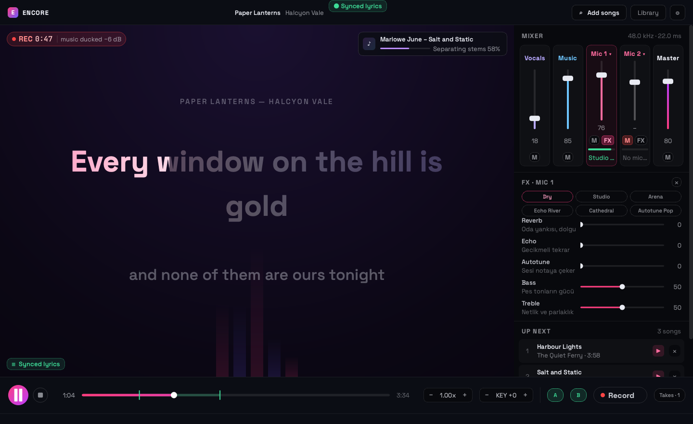
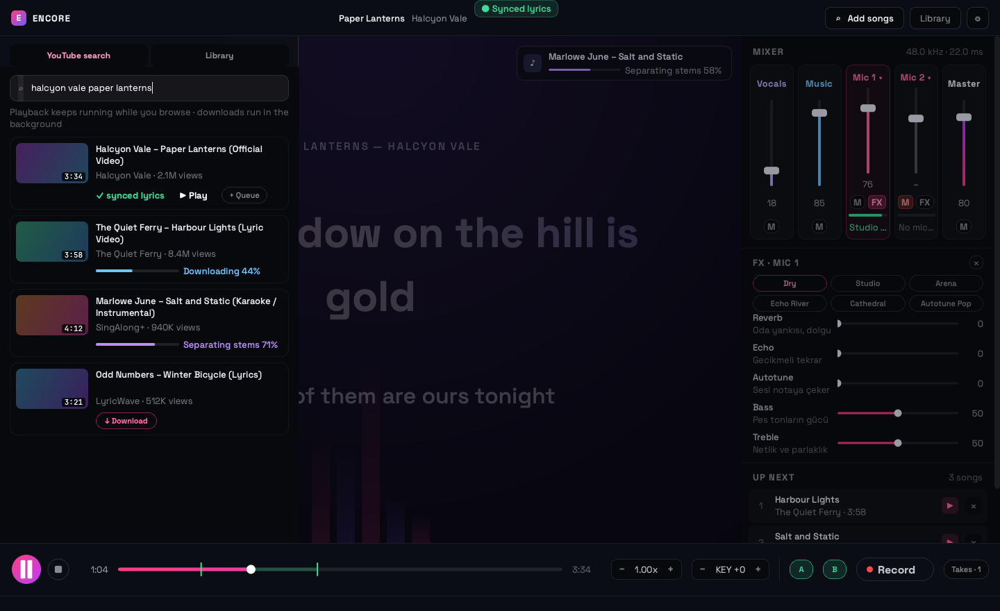

# Encore — Karaoke Studio

Türkçe özet aşağıda ↓

Type a song name. Encore finds it on YouTube, looks its lyrics up in a free
public database, splits the recording into vocals and instrumental with a neural
network, and puts the words on screen in time with the music. If nobody has ever
transcribed that song, it plays the original video instead — so every song works,
one way or another.

Up to four microphones, each with its own effects. Everything slow happens in the
background, so you can queue the next song while somebody is still singing.



<sub>Every song, artist, lyric and thumbnail in these screenshots is invented — see <code>tools/screenshots.py</code>.</sub>

---

## What it does

**Finds the words.** Lyrics come from [LRCLIB](https://lrclib.net) — free, no API
key, no account — which serves *time-stamped* LRC lyrics for a very large share of
popular music. A raw YouTube title almost never matches a database record on the
first try, so Encore cleans the title, guesses which half is the artist, and then
queries six different ways, scoring every candidate on title similarity and track
length. On a real fifteen-song library this took the hit rate from 9/15 to 15/15.

Three outcomes, three stages:

| Result | Stage |
|---|---|
| Timed lyrics | Big gradient lyric that lights up **word by word**, next line underneath |
| Untimed lyrics | Same stage, lines paced evenly across the song and labelled as an estimate |
| Nothing found | The original video plays, muted, with your separated stems as the audio |

**Highlights word by word.** LRCLIB timestamps a line, not a word, so Encore
spreads the words across their line's own span weighted by syllable count — a
three-syllable word gets three times the time of a one-syllable one — and sweeps
the highlight through them. Unsung words stay readable ahead of the beam.

**Splits the song.** Demucs `htdemucs` separates vocals from everything else, using
CUDA or Apple Metal when available and falling back to CPU. Stems are cached, so a
song is only ever separated once.

**Mixes live.** Vocals and instrumental on their own faders (drop the vocals to
sing, raise them to learn), one fader per microphone, and a master. Per-mic
effects: reverb, echo, autotune, bass and treble, with six presets. **Every
microphone starts dry** — effects are something you switch on, never a surprise.
Only *Arena*, *Echo River* and *Cathedral* produce an audible repeat; *Studio* is
a short room and nothing else.

**Stays out of the way.** Searching, downloading and separating all run on worker
threads. The audio engine runs in its own callback and is *polled* by the
interface rather than signalling it, so a busy window can never interrupt the
music. Measured worst case — four microphones with the heaviest presets — is
**7.8 % of one core**.

**Transport for practising.** Tempo without changing key, key without changing
tempo, A/B loop over a hard phrase, and a record button that saves takes as WAV
and ducks the music while you sing.

### Finding songs, without stopping the one that is playing



Search results show whichever stage each song is at — idle, downloading,
separating, or ready with the kind of lyrics it found.

### The library


Everything already prepared, with what it will do on stage: *synced lyrics*,
*lyrics (est. timing)*, or *video stage*.

---

## Getting started

```bash
./setup.sh    # once — installs Python 3.11 and the dependencies with uv
./run.sh      # every time
```

Windows: `setup.bat`, then `run.bat`.

You also need **ffmpeg** on your PATH (`brew install ffmpeg`, or
`sudo apt install ffmpeg`). Downloads arrive in containers libsndfile cannot read,
and ffmpeg is what turns them into audio.

### First run

1. Click **Add songs**, type a song name, press Enter.
2. Hit **Download** on a result. Lyrics, download and separation run behind you —
   the progress badge tells you which stage it is on.
3. When it says *synced lyrics*, press **▶ Play**.

While that song plays you can open the drawer again and queue up the next one.
Nothing stops.

### Keyboard

| Key | Action |
|---|---|
| `Space` | Play / pause |
| `←` `→` | Back / forward five seconds |
| `Ctrl+F` | Search |
| `Ctrl+L` | Library |
| `Ctrl+R` | Start / stop recording |
| `Ctrl+→` | Skip to the next queued song |
| `Esc` | Close the drawer |

### Microphones

**Each mic picks its own device from the mixer** — click the channel's name
(*Mic 1 ▾*) and choose. The name of the chosen device sits under the fader in
green when it opened, with a live input meter above it, so "is it hearing me?"
is answered before you start a song. A device already used by another channel is
greyed out.

**⚙ → Audio settings** covers the output device, how many microphones you want,
and two useful switches:

- **Smart music ducking** — drops the track 6 dB while you record, so the recording
  is a vocal over a backing track rather than a fight.
- **Noise gate** — silences a mic between phrases. On by default; turn it off if
  you are singing very quietly and it clips your first word.

---

## How it is put together

```
karaoke_app/
├── main.py                 entry point
├── audio/
│   ├── engine.py           the real-time mixer: one output stream, one input
│   │                       stream per mic, jitter buffers to reconcile clocks
│   ├── timescale.py        WSOLA time-stretch + resampler — tempo and key,
│   │                       bypassed entirely at 1.00x / key 0
│   ├── fx.py               per-mic chain: gate, high-pass, compressor,
│   │                       autotune, EQ, echo, Freeverb-style reverb
│   ├── lyrics.py           LRCLIB search strategy, LRC parsing, scoring
│   ├── youtube.py          flat search and format-aware download (yt-dlp)
│   └── separation.py       Demucs, with length and silence guards
├── core/
│   ├── jobs.py             the thread pool: search, prepare, lyrics, artwork
│   ├── library.py          the song database (JSON)
│   ├── config.py           persisted settings
│   └── migrate.py          adopts songs prepared by the previous version
└── ui/
    ├── stage.py            lyric, estimated-lyric and video faces
    ├── mixer.py            faders, FX rack, queue
    ├── transport.py        play, scrub, tempo, key, A/B, record, takes
    ├── drawer.py           YouTube search and library
    └── theme.py            design tokens; bundled Space Grotesk + JetBrains Mono
```

Two rules hold the design together:

1. **The audio callback never blocks and never calls Qt.** It does not log, take
   the engine lock, or allocate unpredictably. The window polls the playhead on a
   30 fps timer.
2. **Nothing slow runs on the GUI thread.** Every download, separation, search and
   lyrics lookup is a `QRunnable`. Separation holds a semaphore so only one runs at
   a time, and torch is told to leave two cores free for the audio thread.

### Where files go

Everything lives under `karaoke_app/` (override with `ENCORE_HOME`):

| Folder | Contents |
|---|---|
| `downloads/` | media pulled from YouTube |
| `stems_cache/` | separated vocals and instrumental |
| `lyrics_cache/` | resolved lyrics, one JSON per song |
| `recordings/` | your takes |
| `data/` | library, settings, artwork cache |
| `logs/` | one log per run |

You can drop a `song.lrc` next to any imported file and Encore will use it instead
of searching.

---

## If the microphone echoes

Effects are off by default, so an echo you did not ask for is almost always the
room rather than the software:

- **You are listening on speakers.** The speaker feeds the mic, which feeds the
  speaker. It sounds like enormous reverb and gets worse as you turn the mic up.
  Headphones fix it outright; failing that, drop **Mic monitor level** in the
  settings and point the mic away from the speakers.
- **The mic is far from your mouth** — a webcam or laptop microphone picks up the
  room, and the room *is* the echo. A handheld or headset mic is a bigger
  improvement than any setting in this app.
- **A preset is on.** Open **FX** on that channel and press **Dry**.

## Limits worth knowing

- **20 minutes per track.** Demucs holds four full-length stems in memory at once;
  a two-hour DJ mix needs about 20 GB and, on Metal, comes back as silence rather
  than an error. Encore refuses those up front and checks the output for silence
  afterwards as a backstop.
- **Monitoring latency is your device's, not ours.** The block size is 256 frames
  (≈5.8 ms); the rest is the sound card. A USB interface will beat built-in
  speakers by a wide margin.
- **Two of every hundred songs are filed backwards in LRCLIB.** The lyrics are
  right; the artist and title may be swapped in the library list.

---

## Türkçe

Şarkı adını yazın. Encore onu YouTube'da bulur, sözlerini ücretsiz bir veritabanında
arar, yapay zekâ ile vokal ve enstrümantal olarak ayırır ve sözleri müzikle **eş
zamanlı** ekrana getirir. Sözü hiç yazılmamış bir şarkıysa orijinal videoyu oynatır
— yani her şarkı bir şekilde çalışır.

- **Kurulum:** `./setup.sh` (bir kez), sonra `./run.sh`. Ayrıca `ffmpeg` gerekir.
- **Kullanım:** *Add songs* → şarkı adı → *Download*. İndirme ve ayrıştırma arka
  planda çalışır; bu sırada müzik durmaz, yeni şarkı sıraya eklenebilir.
- **4 mikrofona kadar**, her birine ayrı reverb / echo / autotune / bass / treble.
  Mikrofonlar **temiz (Dry) başlar**; efekt açmadıkça hiçbir yankı eklenmez. Mikrofon
  kendiliğinden yankı yapıyorsa neredeyse her zaman sebep odadır: hoparlörden
  dinliyorsan ses mikrofona geri girer. Kulaklık kullan ya da ayarlardan
  **Mic monitor level**'i düşür.
- **Tempo ve ton ayrı ayrı** değiştirilebilir — şarkıyı yavaşlatın ya da kendi
  sesinize göre tonunu indirin, diğeri bozulmaz.
- **A/B** ile zor bir bölümü döngüye alın, **Record** ile kaydedin (kayıt sırasında
  müzik otomatik 6 dB kısılır).

Sözler [LRCLIB](https://lrclib.net) üzerinden gelir: ücretsiz, API anahtarı
gerektirmez ve zaman damgalı LRC formatında.

---

## Licence

MIT — see `LICENSE`.

Bundled typefaces (`karaoke_app/ui/fonts/`) are Space Grotesk and JetBrains Mono,
both under the SIL Open Font Licence; their licence texts ship alongside them.
Lyrics come from LRCLIB, a community database. Please respect the copyright of the
music you download.
